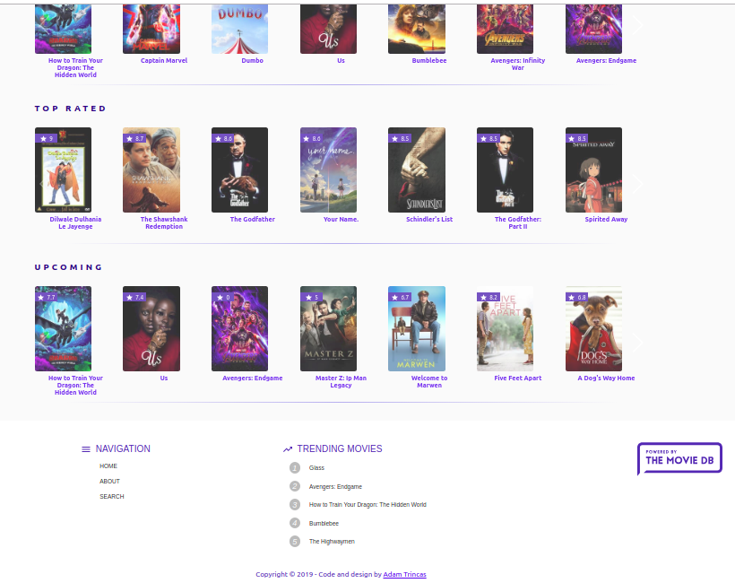

# Movie Selector

React application to browse your favorite movies.

[Live Demo](https://atrincas-movieselector.herokuapp.com).



### What I learned

* Fetch and display data from MovieDB API
* Design the UI with the use of the Material-UI framework.
* Use Redux for state management.
* Build a multi-step form and use collected form values to fetch a list of movies.

## Installation and Setup Instructions

### Prerequisites

```

### Installing

1. npm

```
npm install npm@latest -g
```

2. Clone the repo

```
git clone https://github.com/atrincas/movie-selector.git
```

3. Run npm install inside project root directory

```
npm install
```

4. Start the server

```
npm run start
```

5. Start exploring

```
Enjoy! :)
```
